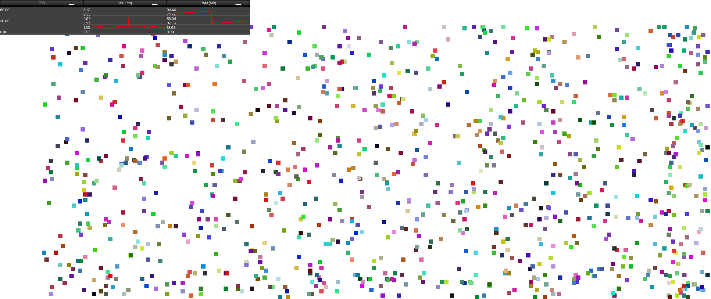

# FXGL Benchmark
This is a simple test program I wrote to show the preformance of the [FXGL](http://almasb.github.io/FXGL/) game engine.
## How to run
The project is built with maven so just install the dependencies and run Main.java.
## What it does
When you start up the program, it asks how many balls to animate. Just type in the number, and it should start up it fullscreen.
It shows the statistics (FPS, CPU, and RAM) in the top left corner.
## Screenshots
